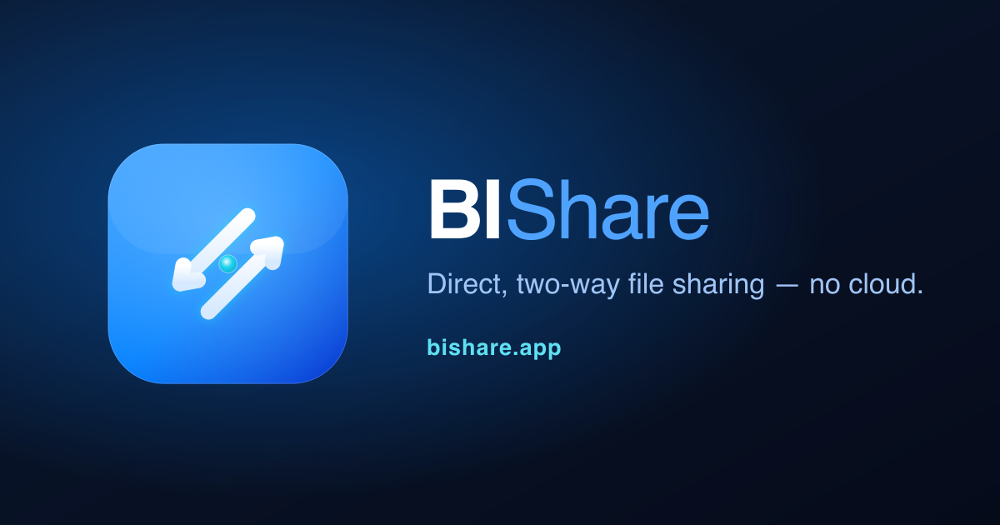
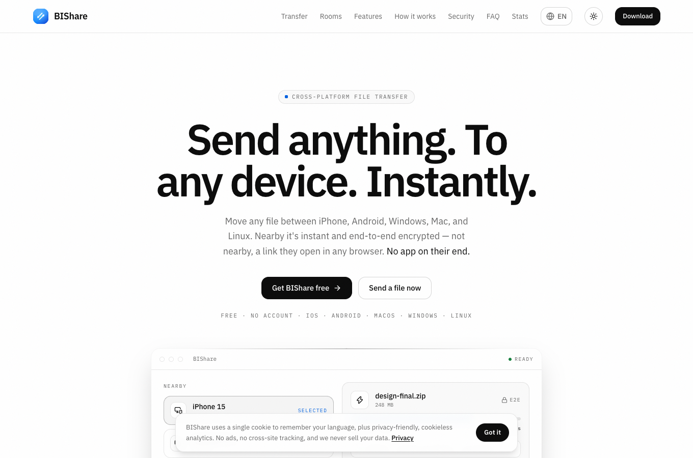
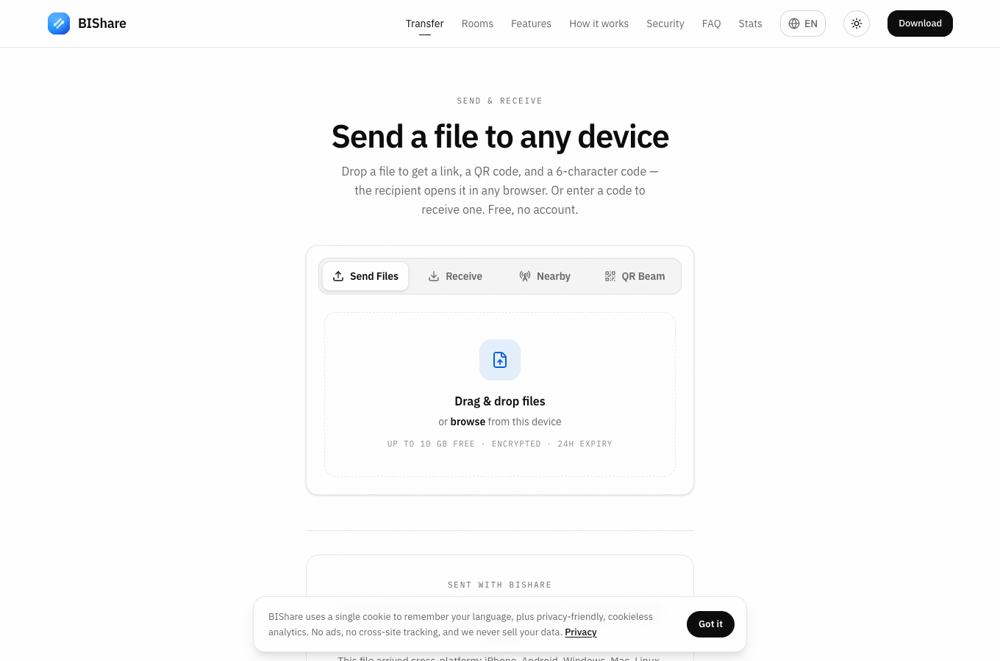
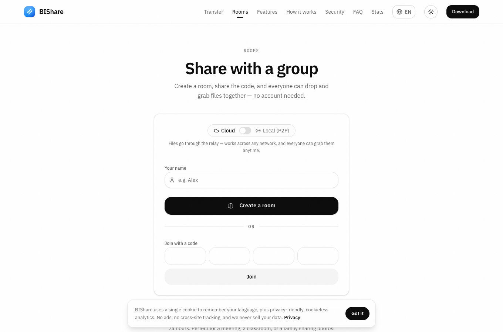
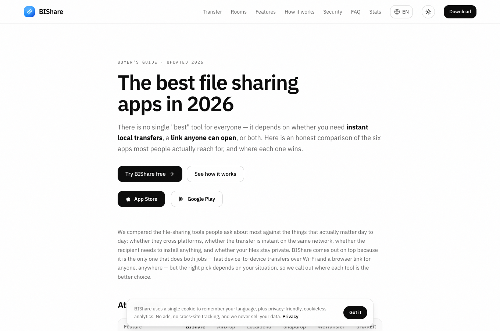

<div align="center">



# BIShare Web

**Open-source, end-to-end-encrypted, no-account file transfer — right in the browser.**

Send a file, get a link the recipient opens in any browser — no app, no sign-up,
nothing stored in the clear. The web app + marketing site behind
[**bishare.app**](https://bishare.app), built with **Next.js** and running on
**Cloudflare Workers**.

[](https://github.com/BIShare-project/bishare-web/actions/workflows/ci.yml)


[](https://github.com/BIShare-project/bishare-web/stargazers)

**[🌐 Live site](https://bishare.app)** &nbsp;·&nbsp; **[🚀 Try the transfer tool](https://bishare.app/transfer)** &nbsp;·&nbsp; **[📊 Live stats](https://bishare.app/stats)**

</div>

---

## Table of contents

- [Screenshots](#screenshots)
- [Why BIShare?](#why-bishare)
- [What's inside](#-whats-inside)
- [How the encryption works](#-how-the-encryption-works)
- [Part of the BIShare ecosystem](#-part-of-the-bishare-ecosystem)
- [Run it locally](#-run-it-locally)
- [Deploy your own](#️-deploy-your-own-cloudflare-workers)
- [Project structure](#-project-structure)
- [Stack](#️-stack)
- [Scripts](#-scripts)
- [Contributing](#-contributing)
- [FAQ](#-faq)
- [License](#license)

## Screenshots

<table>
  <tr>
    <td width="50%"></td>
    <td width="50%"></td>
  </tr>
  <tr>
    <td align="center"><sub><b>Home</b> — bishare.app</sub></td>
    <td align="center"><sub><b>/transfer</b> — zero-knowledge browser transfer</sub></td>
  </tr>
  <tr>
    <td width="50%"></td>
    <td width="50%"></td>
  </tr>
  <tr>
    <td align="center"><sub><b>/rooms</b> — live group sharing</sub></td>
    <td align="center"><sub><b>/best-file-sharing-app</b> — comparison guide</sub></td>
  </tr>
</table>

## Why BIShare?

Snapdrop and PairDrop only work when both people are on the same network.
WeTransfer routes everything through the cloud, caps free transfers, and shows
ads. AirDrop is Apple-only. **BIShare gives you a link that works anywhere —
end-to-end encrypted, no account, and open source.**

|                                    | BIShare | Snapdrop / PairDrop | WeTransfer | Wormhole |
| ---------------------------------- | :-----: | :-----------------: | :--------: | :------: |
| Works in any browser               |    ✅    |          ✅          |     ✅      |    ✅     |
| Send to someone on another network |    ✅    |          ❌          |     ✅      |    ✅     |
| End-to-end encrypted               |    ✅    |          ✅          |     ❌      |    ✅     |
| No account to send **or** receive  |    ✅    |          ✅          |     ✅      |    ✅     |
| No ads / no size gate              |    ✅    |          ✅          |     ❌      |    ✅     |
| Resumable large uploads            |    ✅    |          ❌          |     ✅      |    ❌     |
| Native apps too (iOS/Android/desktop) | ✅    |          ❌          |     ➖      |    ❌     |
| Open source                        |    ✅    |          ✅          |     ❌      |    ✅     |

## ✨ What's inside

- 🔒 **Zero-knowledge browser transfers** (`/transfer`) — files are encrypted
  client-side with **AES-256-GCM** (WebCrypto) before upload. The key stays in
  the URL fragment; the server sees only ciphertext.
- 🔗 **A link for anyone** — the recipient opens it in any browser and downloads.
  No app, no account, and links auto-expire.
- ⚡ **Resumable large uploads** — multipart upload survives a refresh or a
  dropped connection.
- 👥 **Rooms** — share files with a group in a live, shared room over WebRTC/WS.
- 📊 **Live public stats** (`/stats`) — server-rendered counters with a realtime
  WebSocket (`/stats-live`) backed by a Durable Object.
- 🌍 **13 languages** — fully localized via `next-intl`, dark-first design with a
  light toggle.
- 🔎 **SEO-first** — hreflang across every locale, structured data (`SoftwareApplication`,
  `FAQPage`, `ItemList`), sitemap, and an `llms.txt` for AI search engines.
- ☁️ **Runs on the edge** — Next.js App Router on Cloudflare Workers via
  `@opennextjs/cloudflare`; no origin server to babysit.

## 🔐 How the encryption works

Browser transfers are **zero-knowledge** — the relay never sees your data:

```
Sender's browser                         Recipient's browser
────────────────                         ───────────────────
file ──► AES-256-GCM (WebCrypto)         link#k=<key>
         │  key generated locally                │
         ▼                                        ▼
      ciphertext ──► relay (R2) ──► ciphertext ──► decrypt with #k
                     (sees only                    (key from URL
                      ciphertext)                   fragment)
```

The symmetric key lives only in the URL **fragment** (`#k=…`). Browsers never
send the fragment to the server, so the key never reaches the relay — it only
ever stores and forwards ciphertext. Links auto-expire, and there's no account
tying a transfer to you. The native apps use the
[BIShare Rust protocol](https://github.com/BIShare-project/bishare-protocol)
(X25519 + AES-256-GCM) for direct LAN transfers.

## 🧩 Part of the BIShare ecosystem

BIShare is a full cross-platform file-sharing project — this repo is the web piece.

| Repo | What it is |
|---|---|
| **[bishare-flutter](https://github.com/BIShare-project/bishare-flutter)** | The native app — iOS, Android, macOS, Windows, Linux (Flutter + Rust). Instant device-to-device LAN transfer, like AirDrop for every platform. |
| **bishare-web** (this repo) | The website + in-browser transfer tool + live stats. |
| **[bishare-protocol](https://github.com/BIShare-project/bishare-protocol)** | The Rust transfer/crypto protocol (X25519 + AES-256-GCM) shared by the apps. |

The file-transfer **API** (upload/download, rooms, presigned R2 storage,
telemetry) is a separate service; this site talks to it over HTTPS at
`NEXT_PUBLIC_API_URL` (default `https://api.bishare.app`).

## 🚀 Run it locally

**Prerequisites:** Node.js 20+ and npm.

```bash
git clone https://github.com/BIShare-project/bishare-web.git
cd bishare-web
npm install
cp .env.example .env.local     # set NEXT_PUBLIC_API_URL
npm run dev                    # http://localhost:3000
```

The site talks to the transfer API over HTTPS at `NEXT_PUBLIC_API_URL`
(default `https://api.bishare.app`), so `/transfer` works against the hosted
backend out of the box — no local server needed to develop the UI.

## ☁️ Deploy your own (Cloudflare Workers)

[](https://deploy.workers.cloudflare.com/?url=https://github.com/BIShare-project/bishare-web)

1. Fill in your own resource IDs in `wrangler.jsonc` (D1 database, R2 bucket,
   custom domain). The committed file uses `<PLACEHOLDER>` values so no infra
   details are baked into the public repo.
2. Create the D1 database:
   ```bash
   npx wrangler d1 create bishare-web
   ```
3. Build + deploy:
   ```bash
   npm run deploy        # opennextjs build + wrangler deploy
   ```

The web Worker needs **no secrets** — it only reads D1 and serves pages. Point
`NEXT_PUBLIC_API_URL` at your own backend if you self-host the API.

## 📁 Project structure

```
src/
├─ app/
│  └─ [locale]/
│     ├─ (site)/          # marketing + SEO pages (localized)
│     │  ├─ transfer/     #   in-browser E2E transfer tool
│     │  ├─ rooms/        #   group sharing (WebRTC/WS)
│     │  ├─ stats/        #   live public counters
│     │  └─ …             #   features, pricing, comparisons, FAQ, legal
│     └─ layout.tsx       # <html>/<body>, fonts, per-locale dir
├─ components/            # UI (site shell, rooms, transfer widgets)
├─ lib/                   # crypto, API client, rooms/webrtc, SEO helpers
├─ i18n/                  # next-intl routing + request config
└─ messages/<locale>/     # 13-locale message catalogs

worker/index.ts           # Cloudflare Worker entry (Next handler + StatsLiveDO)
server/do/stats-live.ts    # Durable Object powering /stats-live
public/                    # static assets, llms.txt, sitemap inputs
```

## 🛠️ Stack

- **Next.js 15** (App Router) · React · Tailwind · `next-intl` (13 locales)
- **Cloudflare Workers** · **D1** (read-only stats) · **Durable Objects** (`StatsLiveDO`)
- **`@opennextjs/cloudflare`** for the Worker build
- **WebCrypto** (AES-256-GCM) for zero-knowledge browser transfers

## 📜 Scripts

| Command | What it does |
|---|---|
| `npm run dev` | Start the dev server (`next dev`) |
| `npm run build` | Production Next.js build |
| `npm run build:cloudflare` | Build the Cloudflare Worker bundle (OpenNext) |
| `npm run preview` | Build + run the Worker locally (`wrangler dev`) |
| `npm run deploy` | Build + deploy to Cloudflare Workers |

## 🤝 Contributing

PRs are welcome — see **[CONTRIBUTING.md](CONTRIBUTING.md)** for setup, coding
conventions, and how to add a language. Translations are the easiest way to
help: the message catalogs live in `src/messages/<locale>/` and adding a locale
is a few small edits. Found a security issue? Please read **[SECURITY.md](SECURITY.md)**
and report it privately.

## ❓ FAQ

**Is the relay able to read my files?**
No. Files are encrypted in your browser with AES-256-GCM before upload, and the
key lives only in the URL fragment, which browsers never send to the server. The
relay stores and forwards ciphertext only.

**Do I need an account?**
No — neither to send nor to receive. Links auto-expire.

**Can I self-host the whole thing?**
Yes. Deploy this repo to your own Cloudflare Workers, and point
`NEXT_PUBLIC_API_URL` at your own instance of the transfer API.

**How is this different from the native app?**
The app ([bishare-flutter](https://github.com/BIShare-project/bishare-flutter))
adds instant device-to-device transfers over your local network (no upload at
all), offline QR-beam, and cross-platform nearby discovery. This web app is the
zero-install, works-anywhere companion.

## License

Released under the [MIT License](LICENSE) — free to use, modify, and self-host.

---

<div align="center">

**If BIShare is useful to you, please ⭐ star the repo — it genuinely helps.**

**[Website](https://bishare.app)** · **[Transfer tool](https://bishare.app/transfer)** · **[The app](https://github.com/BIShare-project/bishare-flutter)** · **[Protocol](https://github.com/BIShare-project/bishare-protocol)**

</div>
